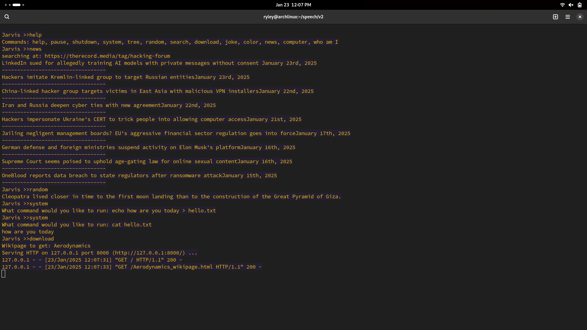
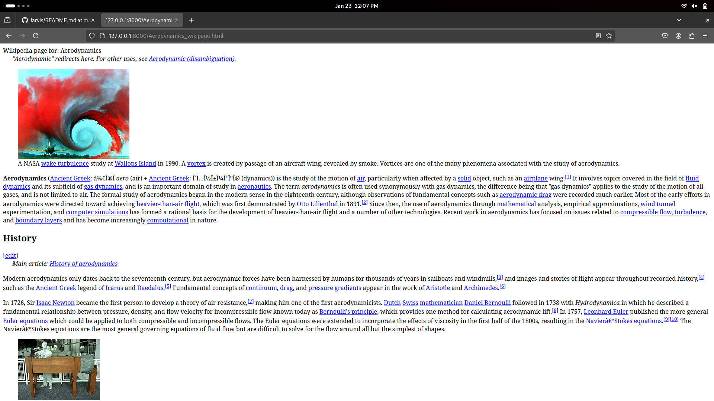
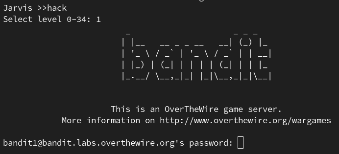

# Jarvis - AI Chatbot

A fully functional chatbot with voice recognition and text input, inspired by J.A.R.V.I.S. from *Iron Man*.
Jarvis can search wikipedia and download the wiki page, give you the news, tell a random fact and much more!
I have been working on Jarvis for about a week as of 01/23/25 and i intend on adding more features, please feel free to contribute and suggest new features.

---

## Contents
   [Requirements](#Requirements)
   
   [Installation and Setup](#Installation%20and%20Setup)
   
   [Requirements](#Requirements)
   
   [Screenshots](#Screenshots)

   [Why?](#Why-I-Built-Jarvis)
   
---

## Requirements
To get started, ensure you have the following Python packages installed:

- `SpeechRecognition`
- `pyttsx3`
- `colorconsole`
- `beautifulsoup4`
- `yt-dlp`

You may need to set up a virtual environment before installing the dependencies.

---

## Installation and Setup
Follow these steps to install and run Jarvis:

1. **Install dependencies:**
   ```bash
   pip install SpeechRecognition pyttsx3 colorconsole beautifulsoup4 yt-dlp
   ```
2. **(Optional) Create and activate a virtual environment:**
   ```bash
   python -m venv venv
   source venv/bin/activate  # On Windows use `venv\Scripts\activate`
   ```
3. **Run the chatbot:**
   ```bash
   python3 speech.py
   ```

### Alternatively
You can install all dependences using the requirements.txt file

1. **Type this command to install all dependencies:**
   ```bash
   pip install -r requirements.txt
   ```
Assuming no errors, all dependencies should be installed.

---

# Warning

   ## Jarvis is not perfect!
   
   **When using speech mode, press the enter key so jarvis can start listening** \
   **Jarvis has a hard time listening so be patient and try and say it slow and as clear as possible** \
   **Text mode is easier for speed but with the right equipment speech mode can be used at long distance if you need to go hands free**
   

---

## Features
Interact with Jarvis by saying or typing the following commands:

- **`help`** - Shows a list of commands you can either say or type.
- **`shut down`** - Shuts downs the machine.
- **`system`** - Prompt for a command that will enter in the terminal.
     *For example:* `ls, echo, rm hello.txt`
- **`joke`** – Displays a funny animation.
- **`color`** – Changes the terminal color.
- **`pause`** – Pauses the microphone.
- **`who am I`** – Displays network information (may not work on all devices).
- **`tree`** – Displays active running tasks.
- **`function`** – Prompts for a word and outputs its length.
- **`search`** – Prompts for a topic, searches Wikipedia, and provides a brief description (works better in text mode).
- **`news`** - Displays hacker news titles.
- **`download`** - Download a wikipedia page to view and save the file to your computer.
  
  *Example search terms:* `Artificial intelligence`, `Mark Zuckerberg`, `Quantum mechanics`, `Google`, `Airplane`.

- **`computer`** – (You might not want to try this one...)
- **`random`** - Tells a random fact.
- **`hack`** - Connect to [Over the wire: Bandit](https://overthewire.org/wargames/bandit/) via ssh for fun hacker challenges.
- **`terminal`** - ssh into your own computer to access full command prompy capabilities.
- **`new project`** - Create a new folder in your home directory titled whatever you like.
- **`movie`** - Play any media file using this command.
- **`get video`**  - Download any youtube video via URL.

---

### Additional Keywords
Jarvis responds to the following keywords:

**Greetings:**
```
"Hello", "hello", "hello Jarvis", "jarvis", "hey Jarvis", "Jarvis", "come in Jarvis", "how are you", "how are you Jarvis", "what's up"
```

**Positive Responses:**
```
"Good", "good", "great", "okay", "okay jarvis", "thanks", "thanks jarvis", "Great", "I'm good", "i'm good", "im good", "i'm okay"
```

**Negative Responses:**
```
"bad", "not good", "no", "No"
```

---

## Screenshots


*Some of the basic functions Jarvis can perform.*


*The page on aerodynamics I had Jarvis download, he then created a live server in which I could view it in!*

 \
*Jarvis succesfully connected to OverTheWire: Bandit via ssh*


---

## Why I Built Jarvis
I created Jarvis because I thought it would be fun to have a chatbot that talks back—plus, I had nothing better to do!

---

### Contributions
Feel free to contribute or suggest new features!

